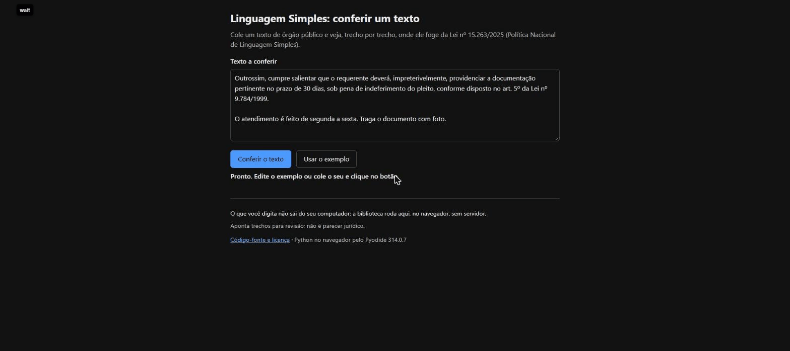

# linguagem-simples-br

[](https://github.com/peterwkdev-creator/linguagem-simples-br/actions/workflows/testes.yml)
[](https://github.com/peterwkdev-creator/linguagem-simples-br/releases/latest)
[](LICENSE)

Verificador aberto da **Lei 15.263/2025**, a Política Nacional de Linguagem
Simples. Confere um texto contra as 18 técnicas do art. 5º e diz, técnica por
técnica, o que achou, onde achou e o que não confere. Feito para servidor
público, órgão e quem escreve para o cidadão.



**[Experimente no navegador](https://peterwkdev-creator.github.io/linguagem-simples-br/)**:
cole o texto, ou o HTML de uma página, e clique. A página roda esta mesma biblioteca no seu
navegador (Pyodide); o texto não sai do seu computador. Na primeira visita
ela baixa cerca de 6 MB e fica pronta em 1,7 s (medido em 10/10/2026, numa
conexão rápida). Depois disso, conferir o texto do exemplo leva uns 5 ms.

**Precisão medida** em páginas de serviço do gov.br, por inciso: XII 100%,
XV 98%, XVII 98%, II 95%, XIV 88%, VIII 78%; o XIII acerta 31% e por isso
só aponta trechos para quem lê decidir. Intervalos em
[Precisão medida](#precisão-medida).

> O resultado aponta trechos para revisão. **Não é parecer jurídico** e não
> certifica que um texto cumpre a lei.

## Instalar

Python 3.11 ou mais novo; só a biblioteca padrão, sem outra dependência.

```bash
pip install "git+https://github.com/peterwkdev-creator/linguagem-simples-br@v1.2.0"
```

Também roda sem instalar, de dentro da pasta do repositório.

## Uso

Na linha de comando:

```bash
python -m linguagem_simples texto.txt
```

Em Python:

```python
from linguagem_simples.relatorio import conferir

texto = "Procure o INSS para pedir o benefício."
for resultado in conferir(texto):
    for o in resultado.ocorrencias:
        print(resultado.inciso.numero, o.trecho, o.mensagem)
# VIII INSS INSS: primeira ocorrência sem o nome completo antes
```

O arquivo é texto, Markdown ou HTML; `-` lê da entrada padrão. O relatório
lista os 18 incisos, na ordem da lei, cada um com a classe e o que
aconteceu. Mais exemplos [abaixo](#mais-exemplos).

## Por quê

A Lei 15.263/2025 vale desde 17/11/2025 para a administração direta e
indireta de todos os Poderes e entes (art. 1º), inclusive os municípios. O
art. 5º lista 18 técnicas de escrita. Algumas se contam no texto (frase
longa, sigla sem o nome antes, voz passiva, link "clique aqui"); outras só
uma pessoa confere (o mais importante primeiro, o teste com o público).

Este verificador aponta o trecho de cada uma que se conta, diz quais não
confere e por quê, e publica quanto acerta, medido em páginas reais de
órgão. Cada limiar e cada palavra dos léxicos vem de um guia oficial, com
a página.

## O que cobre

| Inciso | Texto da lei | O que o detector aponta | Padrão |
|---|---|---|---|
| II | redigir frases curtas | frase longa | mais de 20 palavras |
| III | desenvolver uma ideia por parágrafo | parágrafo longo, sinal de mais de uma ideia | mais de 8 frases |
| VIII | redigir o nome completo antes das siglas | primeira vez que a sigla aparece sem o nome antes | léxico de cores em `linguagem_simples/lexicos/`, com a fonte de cada palavra |
| XII | redigir frases preferencialmente na voz ativa | verbo "ser" com particípio ("foi entregue pela empresa"), com ou sem quem faz a ação | — |
| XIII | evitar frases intercaladas | trecho entre vírgulas no meio da frase que começa por pronome relativo (", que deve ser apresentado pelo requerente,") | — |
| XIV | evitar o uso de substantivos no lugar de verbos | verbo de apoio com substantivo ("faça a identificação") e substantivo do léxico com complemento ("prevenção da Covid-19") | léxico em `linguagem_simples/lexicos/`, com a fonte de cada palavra |
| XV | evitar redundâncias e palavras desnecessárias | expressão do léxico com palavras sobrando ("compareça pessoalmente", "a fim de", "de acordo com") e a forma que o guia sugere | léxico em `linguagem_simples/lexicos/redundancias.txt`: 29 entradas do TRE-AL, do CJF e da CAPES, com a página |
| XVII | usar linguagem acessível à pessoa com deficiência (Lei 13.146/2015) | no HTML, link de texto vago ("clique aqui", "saiba mais"), imagem sem `alt` e tabela sem célula de cabeçalho (`th`); no texto e no Markdown, só o link vago | eMAG 3.1, recomendações 3.5, 3.6 e 3.10; léxico em `linguagem_simples/lexicos/links-vagos.txt`: 46 entradas |

O XIII e o XVII são **sinal**, não automáticos: o XIII acerta 31% das
vezes, e o XVII confere só três pontos do que a Lei 13.146/2015 pede;
os dois apontam trechos para quem lê decidir. Os outros seis são
automáticos.

Os outros 10 incisos aparecem no relatório com a classe de cada um:
**automático** (dá para contar; detector ainda não escrito), **sinal** (dá
para apontar, quem lê decide) ou **fora do alcance** (X e XVIII: só uma
pessoa confere). O inciso XI vem desligado por padrão.

A lei não fixa número. Cada limiar vem de um guia oficial, com a página, em
`linguagem_simples/limiares.py`, e quem usa pode trocar.

## Como é testado

Para rodar os testes:

```bash
python -m unittest -v
```

Cada detector passa por duas provas: pega o defeito plantado e não dispara
no texto que um guia oficial dá como bom. Onde o guia traz um par "antes e
depois", o "antes" tem de dar mais ocorrências que o "depois". Os trechos
estão em `tests/guias.py`, com a página e o hash do PDF. Os exemplos em
Python deste README rodam nos testes, como estão.

### Precisão medida

Dos trechos que cada detector aponta, quantos uma pessoa, lendo o trecho na
página, confirma. Páginas de serviço do gov.br sorteadas, padrões de
fábrica, critério escrito antes de anotar e duas passagens, a segunda às
cegas:

| Inciso | Precisão | Acertos / anotados | Intervalo de 95% (Wilson) | Amostra |
|---|---|---|---|---|
| XII | 100% | 59 / 59 | 94% a 100% | 30 páginas, 09/10/2026 |
| XV | 98% | 59 / 60 | 91% a 100% | 150 páginas, 10/10/2026 |
| XVII | 98% | 49 / 50 | 90% a 100% | 150 páginas, 10/10/2026 |
| II | 95% | 57 / 60 | 86% a 98% | 30 páginas, 09/10/2026 |
| XIV | 88% | 21 / 24 | 69% a 96% | 30 páginas, 09/10/2026 |
| VIII | 78% | 38 / 49 | 64% a 87% | 30 páginas, 09/10/2026 |
| XIII | 31% | 13 / 42 | 19% a 46% | 150 páginas, 09/10/2026 |

III não apontou nada nas 30 páginas da primeira amostra: sem número.
Precisão não é cobertura: o que o detector deixa passar não entra nesta
conta. Do XVII, a cobertura também foi medida: em 30 páginas novas, dos
18 nomes de link vagos, ele aponta 5 (**28%**, de 12% a 51%), sem apontar
nenhum nome que diz o destino. O léxico dele é uma lista fechada (46
expressões na 1.2.0): "Acesse o serviço", "Protocolar" ou as abas "O que
é?" do modelo do gov.br passam sem marca. Cada
amostra, o método e o que os erros mostram estão em
[docs/precisao.md](docs/precisao.md).

## Mais exemplos

O relatório em texto, com a linha e a coluna de cada trecho:

```text
II. redigir frases curtas
   automático; limiar 20, fonte: TJGO p. 9, TRE-AL p. 13, CJF p. 6 e outros dois guias: até 20 palavras por frase (CAPES dá 25); 1 ocorrência
   - linha 1, coluna 1: frase com 27 palavras (limiar: 20): “Certifico e dou fé que, dando cumprimento ao mandado subscrito extraí…”

VIII. redigir o nome completo antes das siglas
   automático; 1 ocorrência
   - linha 3, coluna 21: INSS: primeira ocorrência sem o nome completo antes: “INSS”

X. organizar o texto a fim de que as informações mais importantes apareçam primeiramente
   fora do alcance; não conferido: só uma pessoa confere
```

HTML é reconhecido pela extensão (`.html`, `.htm`), pelo começo do arquivo
(`<!doctype html>` ou `<html>`) ou pela opção `--html`. Texto e Markdown em
UTF-8; HTML em UTF-8 ou no charset que a página declara.

| Opção | O que faz |
|---|---|
| `--json` | relatório em JSON, com início, fim, linha e coluna de cada trecho no arquivo lido |
| `--html` | lê como HTML um arquivo que não tem extensão `.html` |
| `--max-palavras N` | inciso II: palavras por frase (padrão 20) |
| `--max-frases N` | inciso III: frases por parágrafo (padrão 8) |
| `--ignorar-sigla SIGLA` | inciso VIII: sigla que o público já conhece (repetível) |
| `--ligar INCISO` | liga um inciso desligado por padrão, como o XI |
| `--desligar INCISO` | desliga um inciso |
| `--versao` | mostra a versão |

Código de saída: 0 sem ocorrências, 1 com ocorrências, 2 erro de uso ou de
leitura.

Também dá para usar como biblioteca, com a posição de cada trecho:

```python
from linguagem_simples.relatorio import conferir, como_dict

texto = "Procure o INSS. O atendimento é feito de segunda a sexta-feira."
for resultado in conferir(texto):
    for ocorrencia in resultado.ocorrencias:
        print(ocorrencia.inciso, ocorrencia.inicio, ocorrencia.mensagem)
# VIII 10 INSS: primeira ocorrência sem o nome completo antes
# XII 30 voz passiva sem agente: a frase não diz quem faz a ação
```

Para HTML, `ler_html` tira o texto e guarda onde cada trecho e cada link,
imagem e tabela estão na página; o relatório recebe a página no lugar do
texto, confere também o XVII e dá linha e coluna no HTML:

```python
from linguagem_simples.pagina import ler_html
from linguagem_simples.relatorio import conferir, como_texto

pagina = ler_html('<main><p>Para pedir, <a href="/pedir">clique aqui</a>.</p></main>')
for resultado in conferir(pagina):
    for o in resultado.ocorrencias:
        print(o.inciso, o.trecho, o.mensagem)
# XVII clique aqui link com texto que não diz o destino (eMAG 3.5)
print(como_texto(conferir(pagina), pagina))
```

Os detectores também se chamam um a um, em `linguagem_simples/detectores.py`.

## Fontes e limites

### Guias usados

Consultados em 09/10/2026:

- TJGO, Guia de Linguagem Simples do TJGO
- CAPES, O uso da Linguagem Simples na CAPES (2026)
- Anvisa, Guia de Linguagem Simples, 1ª edição
- TRE-AL, Linguagem Simples – Cartilha (2024)
- CJF, Guia de Linguagem Simples (2024)
- SES-DF, Guia para simplificar documentos (2024)
- 10 dicas para escrever um documento em Linguagem Simples (repositório da
  Enap)

Consultado em 10/10/2026: eMAG, Modelo de Acessibilidade em Governo
Eletrônico, versão 3.1 (obrigatório no governo federal pela Portaria SLTI
nº 3, de 07/05/2007), recomendações 3.5, 3.6 e 3.10.

Texto da lei: publicação original no portal da Câmara dos Deputados, DOU de
17/11/2025.

Outras fontes: Dicionário Priberam da Língua Portuguesa (um verbete por
palavra do léxico de cores) e Lei Complementar 95/1998, art. 4º, no portal
do Planalto (epígrafe de ato normativo em maiúsculas).

### Limites conhecidos

- Sigla escrita como nome próprio ("Lacen", "Anvisa") não é reconhecida.
- Com o padrão de 20 palavras, o "depois" da CAPES e o da Anvisa ainda
  têm uma frase acima de 20 (de 21 a 23 palavras); os dois guias aceitam até
  25. Com `--max-palavras 25`, nada aparece.
- XII aponta toda voz passiva com "ser", e a lei diz "preferencialmente":
  o texto que os guias dão como bom também tem passiva sem agente ("podem
  ser utilizadas", TRE-AL; "pode ser punido", Anvisa). A mensagem diz se a
  frase tem ou não quem faz a ação; quem lê decide.
- XII não pega a passiva com "-se" ("recomenda-se"). O par da CAPES
  ("é responsabilidade da CAPES") fica de fora: não tem verbo na passiva.
- XIII só pega o trecho entre vírgulas com pronome relativo; entre
  travessões, não. Não sabe onde a oração termina: aponta a oração no fim
  da frase quando ela tem vírgula por dentro (31% de precisão, acima).
- XIV conhece só as palavras que os guias trazem (12, com o plural); fora
  delas, só aponta "fazer" ou "promover" com substantivo em -ção ou -mento.
- XV conhece só as expressões que os guias trazem. Nas páginas do gov.br,
  quase tudo o que ele aponta é "de acordo com" (TRE-AL p. 17: prefira
  "segundo, conforme, como"); os pleonasmos da lista ("subir para cima")
  não apareceram. "No Estado de Pernambuco" (CJF) fica de fora: pede a
  lista dos estados.
  Não aponta a palavra depois de nome de documento com "de" ("Guia de
  Recolhimento"): o nome do documento não se troca por verbo.
- XVI sem detector, e com a classe **sinal**: nenhum guia
  oficial dá lista de palavras imprecisas. O Manual de Redação da
  Presidência (2018, p. 17) e o TJMG (p. 6) só dão a regra; a CAPES
  (p. 11), um exemplo ("por descumprimento da norma"); o TJRS (p. 58),
  comandos de despacho ("cumpra-se", "intime-se"). E o mesmo Manual usa
  "oportunamente" num exemplo certo (p. 62), que o TJGO (p. 15) reescreve.
  Se a palavra é imprecisa depende do contexto: quem lê decide.
- XVII lê só a marcação: não vê a imagem, não segue o link e não aplica o
  CSS. Confere três recomendações do eMAG; as outras exigências da Lei
  13.146/2015 que o inciso cita ficam com quem lê. No texto e no Markdown,
  só aponta o link vago ("[clique aqui](url)").
- XVII conta como nome do link o texto, o `alt` da imagem dentro dele, o
  `aria-label` e o `aria-labelledby`; o `title` não conta (eMAG 3.5). Link
  sem nome nenhum fica de fora. Imagem com `alt=""`, `aria-hidden="true"`
  ou `role="presentation"` é enfeite e fica de fora; tabela com
  `role="presentation"` também. Tabela de leiaute sem esse `role` é
  apontada: quem lê decide.
- XVII nas páginas do gov.br: o "Saiba mais" do quadro "Login Integrado"
  do portal fica dentro do `<main>` e aparece em quase toda página.
- HTML: se a página tem `<main>`, só o que está dentro dele conta; sem
  `<main>`, a página inteira, menos menu (`<nav>`), código, formulário e o
  que tem o atributo `hidden`. O CSS não é aplicado: texto escondido por
  CSS entra. Elementos lado a lado sem espaço no HTML colam as palavras
  ("22:24Modificado").
- VIII deixa de fora a palavra em caixa alta que aparece em minúscula no
  mesmo texto (de cinco letras em diante), o nome de cor ("VERMELHO -
  Emergência"), endereço ("GOV.BR") e o "DE" e o mês da data na epígrafe
  de ato normativo ("RDC Nº 513, DE 27 DE MAIO DE 2021", que a LC 95/1998,
  art. 4º, manda grafar em maiúsculas). Fora disso, palavra comum em caixa
  alta ainda é apontada ("SENHA", "BUSCAR").
- VIII reconhece o nome antes da sigla ligado a ela ("Nome (SIGLA)",
  "Nome - SIGLA" ou o nome próprio colado, "Nome SIGLA", com uma ou mais
  letras de cada palavra e até duas palavras puladas) ou, em qualquer
  ponto antes, como nome próprio cujas iniciais são a sigla: o nome
  inteiro ou, se a sigla tem três letras ou mais, o fim dele depois de um
  conectivo ("Secretaria Especial da Receita Federal do Brasil" serve a
  RFB). Com duas letras, o fim do nome coincide demais ("Cadastro de
  Pessoa Física" e a PF de Polícia Federal). Fora disso aponta:
  "Coordenação-Geral de Autorização para Transferência Fusão, Cisão,
  Incorporação e Retirada - CGTR" pula quatro palavras do nome. Abreviatura de mês ("31 DEZ")
  também é apontada, e a sigla cujas letras não saem das iniciais do nome
  que vem antes: a sigla em inglês ("Serviços de Tráfego Aéreo (ATS)") e a
  que pega sílabas ("Cadastro de Imóveis Rurais (CAFIR)").

## O que há em cada pasta

- `linguagem_simples/`: a biblioteca. `incisos.py` tem os 18 incisos, com
  o texto da lei e a classe de cada um; `texto.py` divide o texto em
  blocos e frases; `pagina.py` lê o HTML; `detectores.py`, um detector por
  inciso; `limiares.py`, os limiares com a fonte; `relatorio.py`, o
  relatório em texto e JSON; `__main__.py`, a linha de comando.
- `linguagem_simples/lexicos/`: os léxicos, uma entrada por linha, com a
  fonte.
- `tests/`: os testes; `tests/guias.py` traz os trechos dos guias, com a
  página e o hash, e `tests/test_readme.py` roda os exemplos deste README.
- `vitrine/`: a página do "Experimente no navegador". O GitHub Actions a
  monta e publica a cada push que muda a biblioteca, a página ou os testes
  (`.github/workflows/pages.yml`).
- `docs/`: o GIF do começo deste README e o
  [histórico da precisão](docs/precisao.md).
- [`CHANGELOG.md`](CHANGELOG.md): o que mudou em cada versão.

## Compatibilidade

Versão semântica: o formato do relatório (texto e JSON) e as opções da
linha de comando só mudam numa versão 2; detector novo sai numa 1.x. O que
mudou em cada versão está no [CHANGELOG.md](CHANGELOG.md).

## Contribuir

Resultado diferente do esperado ou caso que falta?
[Abra uma issue](https://github.com/peterwkdev-creator/linguagem-simples-br/issues/new/choose)
pelo modelo "Resultado diferente do esperado", com texto inventado ou de
página pública, sem dado de pessoa. Para mandar código, veja o
[CONTRIBUTING.md](CONTRIBUTING.md); a conversa segue o
[código de conduta](CODE_OF_CONDUCT.md).

## Licença

[MIT](LICENSE).
